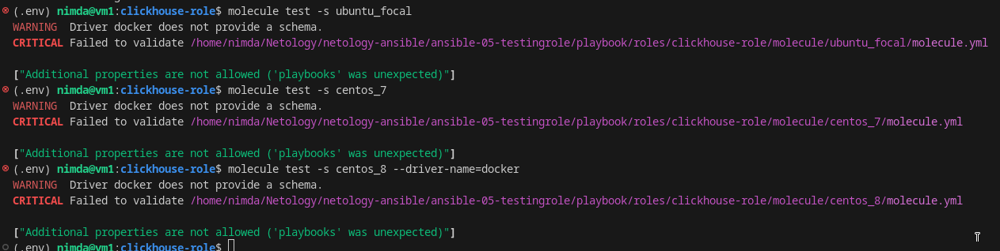
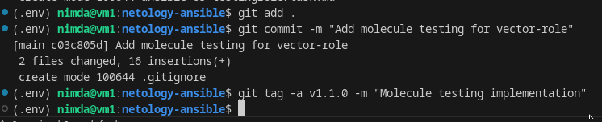

# Домашнее задание к занятию 5 «Тестирование roles» - `Горелов Николай`


### Molecule

1. molecule test - **clickhouse**  



---

2. **vector-role**  

<details>

<summary>Molecule test</summary>

```bash

(.env) nimda@vm1:vector-role$ molecule test --driver-name=docker
WARNING  Driver docker does not provide a schema.
INFO     default scenario test matrix: dependency, cleanup, destroy, syntax, create, prepare, converge, idempotence, side_effect, verify, cleanup, destroy
INFO     Performing prerun with role_name_check=0...
WARNING  Another version of 'ansible.posix' 1.5.4 was found installed in /home/nimda/Netology/netology-ansible/ansible-05-testingrole/.env/lib/python3.11/site-packages/ansible_collections, only the first one will be used, 2.1.0 (/home/nimda/.ansible/collections/ansible_collections).
WARNING  Another version of 'community.docker' 3.4.9 was found installed in /home/nimda/Netology/netology-ansible/ansible-05-testingrole/.env/lib/python3.11/site-packages/ansible_collections, only the first one will be used, 4.7.0 (/home/nimda/.ansible/collections/ansible_collections).
WARNING  Another version of 'containers.podman' 1.10.3 was found installed in /home/nimda/Netology/netology-ansible/ansible-05-testingrole/.env/lib/python3.11/site-packages/ansible_collections, only the first one will be used, 1.17.0 (/home/nimda/.ansible/collections/ansible_collections).
INFO     Running default > dependency
WARNING  Skipping, missing the requirements file.
WARNING  Skipping, missing the requirements file.
INFO     Running default > cleanup
WARNING  Skipping, cleanup playbook not configured.
INFO     Running default > destroy
INFO     Sanity checks: 'docker'

PLAY [Destroy] *****************************************************************

TASK [Set async_dir for HOME env] **********************************************
ok: [localhost]

TASK [Destroy molecule instance(s)] ********************************************
changed: [localhost] => (item=rockylinux9)
changed: [localhost] => (item=ubuntu24)

TASK [Wait for instance(s) deletion to complete] *******************************
FAILED - RETRYING: [localhost]: Wait for instance(s) deletion to complete (300 retries left).
changed: [localhost] => (item=rockylinux9)
changed: [localhost] => (item=ubuntu24)

TASK [Delete docker networks(s)] ***********************************************
skipping: [localhost]

PLAY RECAP *********************************************************************
localhost                  : ok=3    changed=2    unreachable=0    failed=0    skipped=1    rescued=0    ignored=0

INFO     Running default > syntax

playbook: /home/nimda/Netology/netology-ansible/ansible-05-testingrole/playbook/roles/vector-role/molecule/default/converge.yml
INFO     Running default > create

PLAY [Create] ******************************************************************

TASK [Set async_dir for HOME env] **********************************************
ok: [localhost]

TASK [Log into a Docker registry] **********************************************
skipping: [localhost] => (item=None) 
skipping: [localhost] => (item=None) 
skipping: [localhost]

TASK [Check presence of custom Dockerfiles] ************************************
ok: [localhost] => (item={'capabilities': ['SYS_ADMIN'], 'cgroupns_mode': 'host', 'image': 'docker.io/geerlingguy/docker-rockylinux9-ansible:latest', 'name': 'rockylinux9', 'pre_build_image': True, 'privileged': True, 'volumes': ['/sys/fs/cgroup:/sys/fs/cgroup:rw']})
ok: [localhost] => (item={'cgroupns_mode': 'host', 'image': 'docker.io/geerlingguy/docker-ubuntu2404-ansible:latest', 'name': 'ubuntu24', 'pre_build_image': True, 'privileged': True, 'volumes': ['/sys/fs/cgroup:/sys/fs/cgroup:rw']})

TASK [Create Dockerfiles from image names] *************************************
skipping: [localhost] => (item={'capabilities': ['SYS_ADMIN'], 'cgroupns_mode': 'host', 'image': 'docker.io/geerlingguy/docker-rockylinux9-ansible:latest', 'name': 'rockylinux9', 'pre_build_image': True, 'privileged': True, 'volumes': ['/sys/fs/cgroup:/sys/fs/cgroup:rw']})
skipping: [localhost] => (item={'cgroupns_mode': 'host', 'image': 'docker.io/geerlingguy/docker-ubuntu2404-ansible:latest', 'name': 'ubuntu24', 'pre_build_image': True, 'privileged': True, 'volumes': ['/sys/fs/cgroup:/sys/fs/cgroup:rw']})
skipping: [localhost]

TASK [Synchronization the context] *********************************************
skipping: [localhost] => (item={'capabilities': ['SYS_ADMIN'], 'cgroupns_mode': 'host', 'image': 'docker.io/geerlingguy/docker-rockylinux9-ansible:latest', 'name': 'rockylinux9', 'pre_build_image': True, 'privileged': True, 'volumes': ['/sys/fs/cgroup:/sys/fs/cgroup:rw']})
skipping: [localhost] => (item={'cgroupns_mode': 'host', 'image': 'docker.io/geerlingguy/docker-ubuntu2404-ansible:latest', 'name': 'ubuntu24', 'pre_build_image': True, 'privileged': True, 'volumes': ['/sys/fs/cgroup:/sys/fs/cgroup:rw']})
skipping: [localhost]

TASK [Discover local Docker images] ********************************************
ok: [localhost] => (item={'changed': False, 'skipped': True, 'skip_reason': 'Conditional result was False', 'false_condition': 'not item.pre_build_image | default(false)', 'item': {'capabilities': ['SYS_ADMIN'], 'cgroupns_mode': 'host', 'image': 'docker.io/geerlingguy/docker-rockylinux9-ansible:latest', 'name': 'rockylinux9', 'pre_build_image': True, 'privileged': True, 'volumes': ['/sys/fs/cgroup:/sys/fs/cgroup:rw']}, 'ansible_loop_var': 'item', 'i': 0, 'ansible_index_var': 'i'})
ok: [localhost] => (item={'changed': False, 'skipped': True, 'skip_reason': 'Conditional result was False', 'false_condition': 'not item.pre_build_image | default(false)', 'item': {'cgroupns_mode': 'host', 'image': 'docker.io/geerlingguy/docker-ubuntu2404-ansible:latest', 'name': 'ubuntu24', 'pre_build_image': True, 'privileged': True, 'volumes': ['/sys/fs/cgroup:/sys/fs/cgroup:rw']}, 'ansible_loop_var': 'item', 'i': 1, 'ansible_index_var': 'i'})

TASK [Build an Ansible compatible image (new)] *********************************
skipping: [localhost] => (item=molecule_local/docker.io/geerlingguy/docker-rockylinux9-ansible:latest) 
skipping: [localhost] => (item=molecule_local/docker.io/geerlingguy/docker-ubuntu2404-ansible:latest) 
skipping: [localhost]

TASK [Create docker network(s)] ************************************************
skipping: [localhost]

TASK [Determine the CMD directives] ********************************************
ok: [localhost] => (item={'capabilities': ['SYS_ADMIN'], 'cgroupns_mode': 'host', 'image': 'docker.io/geerlingguy/docker-rockylinux9-ansible:latest', 'name': 'rockylinux9', 'pre_build_image': True, 'privileged': True, 'volumes': ['/sys/fs/cgroup:/sys/fs/cgroup:rw']})
ok: [localhost] => (item={'cgroupns_mode': 'host', 'image': 'docker.io/geerlingguy/docker-ubuntu2404-ansible:latest', 'name': 'ubuntu24', 'pre_build_image': True, 'privileged': True, 'volumes': ['/sys/fs/cgroup:/sys/fs/cgroup:rw']})

TASK [Create molecule instance(s)] *********************************************
changed: [localhost] => (item=rockylinux9)
changed: [localhost] => (item=ubuntu24)

TASK [Wait for instance(s) creation to complete] *******************************
FAILED - RETRYING: [localhost]: Wait for instance(s) creation to complete (300 retries left).
changed: [localhost] => (item={'failed': 0, 'started': 1, 'finished': 0, 'ansible_job_id': 'j249156494800.1975454', 'results_file': '/home/nimda/.ansible_async/j249156494800.1975454', 'changed': True, 'item': {'capabilities': ['SYS_ADMIN'], 'cgroupns_mode': 'host', 'image': 'docker.io/geerlingguy/docker-rockylinux9-ansible:latest', 'name': 'rockylinux9', 'pre_build_image': True, 'privileged': True, 'volumes': ['/sys/fs/cgroup:/sys/fs/cgroup:rw']}, 'ansible_loop_var': 'item'})
changed: [localhost] => (item={'failed': 0, 'started': 1, 'finished': 0, 'ansible_job_id': 'j902223683270.1975490', 'results_file': '/home/nimda/.ansible_async/j902223683270.1975490', 'changed': True, 'item': {'cgroupns_mode': 'host', 'image': 'docker.io/geerlingguy/docker-ubuntu2404-ansible:latest', 'name': 'ubuntu24', 'pre_build_image': True, 'privileged': True, 'volumes': ['/sys/fs/cgroup:/sys/fs/cgroup:rw']}, 'ansible_loop_var': 'item'})

PLAY RECAP *********************************************************************
localhost                  : ok=6    changed=2    unreachable=0    failed=0    skipped=5    rescued=0    ignored=0

INFO     Running default > prepare
WARNING  Skipping, prepare playbook not configured.
INFO     Running default > converge

PLAY [Converge] ****************************************************************

TASK [Gathering Facts] *********************************************************
ok: [rockylinux9]
ok: [ubuntu24]

TASK [Include vector role] *****************************************************

TASK [vector-role : Copy Vector .deb package from local files] *****************
skipping: [rockylinux9]
changed: [ubuntu24]

TASK [vector-role : Copy Vector .rpm package from local files] *****************
skipping: [ubuntu24]
changed: [rockylinux9]

TASK [vector-role : Install Vector package (Debian)] ***************************
skipping: [rockylinux9]
changed: [ubuntu24]

TASK [vector-role : Install Vector package (RedHat)] ***************************
skipping: [ubuntu24]
changed: [rockylinux9]

TASK [vector-role : Ensure Vector directories exist] ***************************
ok: [rockylinux9] => (item=/etc/vector)
ok: [ubuntu24] => (item=/etc/vector)
ok: [rockylinux9] => (item=/var/lib/vector)
ok: [ubuntu24] => (item=/var/lib/vector)

TASK [vector-role : Create basic Vector configuration] *************************
changed: [rockylinux9]
changed: [ubuntu24]

TASK [vector-role : Manage vector service (only if enabled)] *******************
skipping: [rockylinux9]
skipping: [ubuntu24]

PLAY RECAP *********************************************************************
rockylinux9                : ok=5    changed=3    unreachable=0    failed=0    skipped=3    rescued=0    ignored=0
ubuntu24                   : ok=5    changed=3    unreachable=0    failed=0    skipped=3    rescued=0    ignored=0

INFO     Running default > idempotence

PLAY [Converge] ****************************************************************

TASK [Gathering Facts] *********************************************************
ok: [rockylinux9]
ok: [ubuntu24]

TASK [Include vector role] *****************************************************

TASK [vector-role : Copy Vector .deb package from local files] *****************
skipping: [rockylinux9]
ok: [ubuntu24]

TASK [vector-role : Copy Vector .rpm package from local files] *****************
skipping: [ubuntu24]
ok: [rockylinux9]

TASK [vector-role : Install Vector package (Debian)] ***************************
skipping: [rockylinux9]
ok: [ubuntu24]

TASK [vector-role : Install Vector package (RedHat)] ***************************
skipping: [ubuntu24]
ok: [rockylinux9]

TASK [vector-role : Ensure Vector directories exist] ***************************
ok: [ubuntu24] => (item=/etc/vector)
ok: [rockylinux9] => (item=/etc/vector)
ok: [ubuntu24] => (item=/var/lib/vector)
ok: [rockylinux9] => (item=/var/lib/vector)

TASK [vector-role : Create basic Vector configuration] *************************
ok: [rockylinux9]
ok: [ubuntu24]

TASK [vector-role : Manage vector service (only if enabled)] *******************
skipping: [rockylinux9]
skipping: [ubuntu24]

PLAY RECAP *********************************************************************
rockylinux9                : ok=5    changed=0    unreachable=0    failed=0    skipped=3    rescued=0    ignored=0
ubuntu24                   : ok=5    changed=0    unreachable=0    failed=0    skipped=3    rescued=0    ignored=0

INFO     Idempotence completed successfully.
INFO     Running default > side_effect
WARNING  Skipping, side effect playbook not configured.
INFO     Running default > verify
INFO     Running Ansible Verifier

PLAY [Verify Vector without systemd] *******************************************

TASK [Gathering Facts] *********************************************************
ok: [rockylinux9]
ok: [ubuntu24]

TASK [Check vector binary exists] **********************************************
ok: [ubuntu24]
ok: [rockylinux9]

TASK [Assert vector binary exists] *********************************************
ok: [rockylinux9] => {
    "changed": false,
    "msg": "Vector binary is present"
}
ok: [ubuntu24] => {
    "changed": false,
    "msg": "Vector binary is present"
}

TASK [Get vector version] ******************************************************
ok: [rockylinux9]
ok: [ubuntu24]

TASK [Display vector version] **************************************************
ok: [rockylinux9] => {
    "msg": "Vector version: vector 0.25.2 (x86_64-unknown-linux-gnu d690c44 2022-11-29)"
}
ok: [ubuntu24] => {
    "msg": "Vector version: vector 0.25.2 (x86_64-unknown-linux-gnu d690c44 2022-11-29)"
}

TASK [Ensure config file exists] ***********************************************
ok: [ubuntu24]
ok: [rockylinux9]

TASK [Assert config file exists] ***********************************************
ok: [rockylinux9] => {
    "changed": false,
    "msg": "Vector config file exists"
}
ok: [ubuntu24] => {
    "changed": false,
    "msg": "Vector config file exists"
}

TASK [Validate vector configuration] *******************************************
ok: [ubuntu24]
ok: [rockylinux9]

TASK [Assert config is valid] **************************************************
ok: [rockylinux9] => {
    "changed": false,
    "msg": "Vector configuration is valid"
}
ok: [ubuntu24] => {
    "changed": false,
    "msg": "Vector configuration is valid"
}

PLAY RECAP *********************************************************************
rockylinux9                : ok=9    changed=0    unreachable=0    failed=0    skipped=0    rescued=0    ignored=0
ubuntu24                   : ok=9    changed=0    unreachable=0    failed=0    skipped=0    rescued=0    ignored=0

INFO     Verifier completed successfully.
INFO     Running default > cleanup
WARNING  Skipping, cleanup playbook not configured.
INFO     Running default > destroy

PLAY [Destroy] *****************************************************************

TASK [Set async_dir for HOME env] **********************************************
ok: [localhost]

TASK [Destroy molecule instance(s)] ********************************************
changed: [localhost] => (item=rockylinux9)
changed: [localhost] => (item=ubuntu24)

TASK [Wait for instance(s) deletion to complete] *******************************
FAILED - RETRYING: [localhost]: Wait for instance(s) deletion to complete (300 retries left).
changed: [localhost] => (item=rockylinux9)
changed: [localhost] => (item=ubuntu24)

TASK [Delete docker networks(s)] ***********************************************
skipping: [localhost]

PLAY RECAP *********************************************************************
localhost                  : ok=3    changed=2    unreachable=0    failed=0    skipped=1    rescued=0    ignored=0

INFO     Pruning extra files from scenario ephemeral directory
(.env) nimda@vm1:vector-role$ 

```

</details>

---

3. **Тег**  



---


### Tox

<details>

<summary>tox в контейнере</summary>

```bash
(.env) nimda@vm1:vector-role$ docker run --privileged=True -v /home/nimda/Netology/netology-ansible/ansible-05-testingrole/playbook/roles/vector-role:/opt/vector-role -w /opt/vecto
r-role -it aragast/netology:latest /bin/bash
[root@1c11566ad860 vector-role]# tox
py37-ansible210 create: /opt/vector-role/.tox/py37-ansible210
py37-ansible210 installdeps: -rtox-requirements.txt, ansible<3.0
py37-ansible210 installed: ansible==2.10.7,ansible-base==2.10.17,ansible-compat==1.0.0,arrow==1.2.3,bcrypt==4.2.1,binaryornot==0.4.4,cached-property==1.5.2,Cerberus==1.3.8,certifi==2025.11.12,cffi==1.15.1,chardet==5.2.0,charset-normalizer==3.4.4,click==8.1.8,click-help-colors==0.9.4,cookiecutter==2.6.0,cryptography==45.0.7,distro==1.9.0,enrich==1.2.7,idna==3.10,importlib-metadata==6.7.0,Jinja2==3.1.6,jmespath==1.0.1,lxml==5.4.0,markdown-it-py==2.2.0,MarkupSafe==2.1.5,mdurl==0.1.2,molecule==3.6.1,molecule-podman==1.1.0,packaging==24.0,paramiko==2.12.0,pluggy==1.2.0,pycparser==2.21,Pygments==2.17.2,PyNaCl==1.5.0,python-dateutil==2.9.0.post0,python-slugify==8.0.4,PyYAML==6.0.1,requests==2.31.0,rich==13.8.1,selinux==0.2.1,six==1.17.0,subprocess-tee==0.3.5,text-unidecode==1.3,typing_extensions==4.7.1,urllib3==2.0.7,zipp==3.15.0
py37-ansible210 run-test-pre: PYTHONHASHSEED='788052345'
py37-ansible210 run-test: commands[0] | molecule test -s compatibility --destroy always

/opt/vector-role/.tox/py37-ansible210/lib/python3.7/site-packages/ansible/parsing/vault/__init__.py:44: CryptographyDeprecationWarning: Python 3.7 is no longer supported by the Python core team and support for it is deprecated in cryptography. The next release of cryptography will remove support for Python 3.7.
  from cryptography.exceptions import InvalidSignature
CRITICAL 'molecule/compatibility/molecule.yml' glob failed.  Exiting.
ERROR: InvocationError for command /opt/vector-role/.tox/py37-ansible210/bin/molecule test -s compatibility --destroy always (exited with code 1)
py37-ansible30 create: /opt/vector-role/.tox/py37-ansible30
py37-ansible30 installdeps: -rtox-requirements.txt, ansible<3.1


py37-ansible30 installed: ansible==3.0.0,ansible-base==2.10.17,ansible-compat==1.0.0,arrow==1.2.3,bcrypt==4.2.1,binaryornot==0.4.4,cached-property==1.5.2,Cerberus==1.3.8,certifi==2025.11.12,cffi==1.15.1,chardet==5.2.0,charset-normalizer==3.4.4,click==8.1.8,click-help-colors==0.9.4,cookiecutter==2.6.0,cryptography==45.0.7,distro==1.9.0,enrich==1.2.7,idna==3.10,importlib-metadata==6.7.0,Jinja2==3.1.6,jmespath==1.0.1,lxml==5.4.0,markdown-it-py==2.2.0,MarkupSafe==2.1.5,mdurl==0.1.2,molecule==3.6.1,molecule-podman==1.1.0,packaging==24.0,paramiko==2.12.0,pluggy==1.2.0,pycparser==2.21,Pygments==2.17.2,PyNaCl==1.5.0,python-dateutil==2.9.0.post0,python-slugify==8.0.4,PyYAML==6.0.1,requests==2.31.0,rich==13.8.1,selinux==0.2.1,six==1.17.0,subprocess-tee==0.3.5,text-unidecode==1.3,typing_extensions==4.7.1,urllib3==2.0.7,zipp==3.15.0
py37-ansible30 run-test-pre: PYTHONHASHSEED='788052345'
py37-ansible30 run-test: commands[0] | molecule test -s compatibility --destroy always
/opt/vector-role/.tox/py37-ansible30/lib/python3.7/site-packages/ansible/parsing/vault/__init__.py:44: CryptographyDeprecationWarning: Python 3.7 is no longer supported by the Python core team and support for it is deprecated in cryptography. The next release of cryptography will remove support for Python 3.7.
  from cryptography.exceptions import InvalidSignature
CRITICAL 'molecule/compatibility/molecule.yml' glob failed.  Exiting.
ERROR: InvocationError for command /opt/vector-role/.tox/py37-ansible30/bin/molecule test -s compatibility --destroy always (exited with code 1)
py39-ansible210 create: /opt/vector-role/.tox/py39-ansible210
py39-ansible210 installdeps: -rtox-requirements.txt, ansible<3.0

```

</details>

---