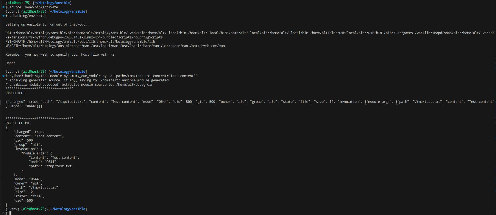
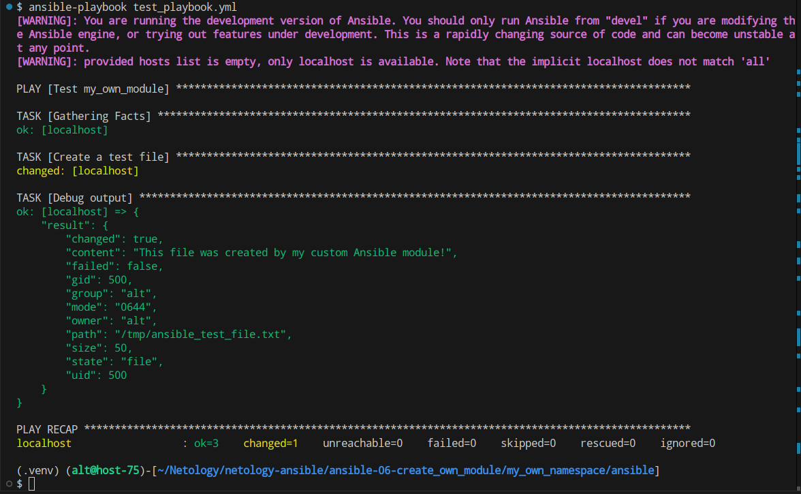
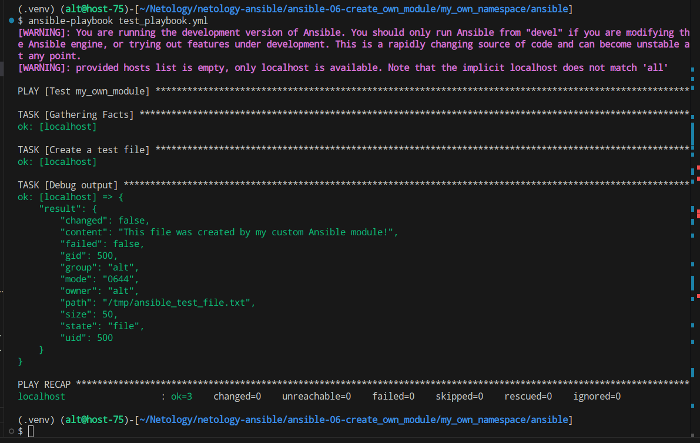
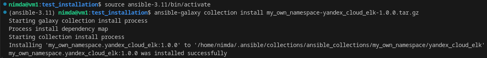
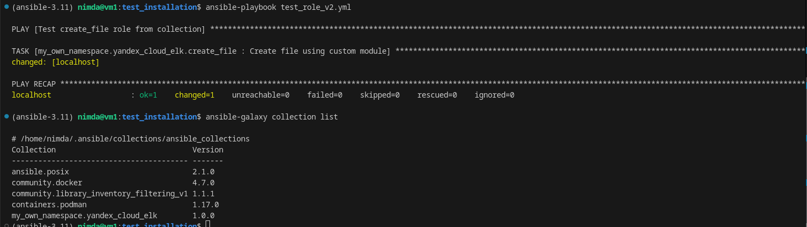
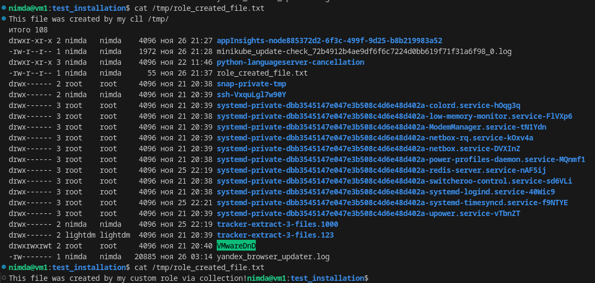

# Домашнее задание к занятию 6 «Создание собственных модулей» - `Горелов Николай`

## Основная часть

**1-3** шаги делаются по заданию.

**Шаг 4.**

5. [single-task-playbook](./my_own_namespace/ansible/test_playbook.yml)

6.   

  
  

C **7** по **12** шаги выполняются согласно заданию.

Результат  `ansible-galaxy collection build`;

[my_own_namespace-yandex_cloud_elk-1.0.0.tar.gz](./my_own_namespace/yandex_cloud_elk/my_own_namespace-yandex_cloud_elk-1.0.0.tar.gz)

В завершении устанавливаем collection и запускаем playbook на другом ПК для проверки работоспособности.

Используем single playbook:

[test-playbook](./test_role_v2.yml)

**Результат:** 

  
  

---

